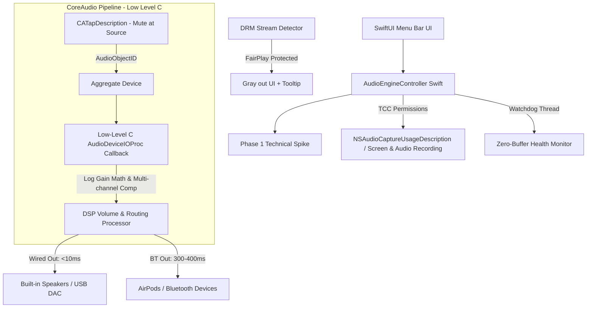

# Technical Architecture & Implementation Plan: macOS SoundFlow

## Executive Summary & Architecture Overview

**"SoundFlow"** is a native macOS Menu Bar application built with **Swift, C/CoreAudio, and SwiftUI** that provides master output/input management and granular **per-application volume control and audio routing**.

By targeting **macOS 14.4+ (and macOS 15/26)** exclusively, the application utilizes Core Audio's native **Process Tap API** (`AudioHardwareCreateProcessTap` and `CATapDescription`). 

> [!IMPORTANT]  
> **Key Architectural Insight: Capturing vs. Controlling Audio**  
> A standard Process Tap acts as an audio "wiretap"—it creates a copy of an app's audio stream while the original audio continues to play directly to the system speaker. To transform a tap into a **volume controller**, SoundFlow configures the tap's mute flags to silence the process's original output at the source, routes the tapped stream into a low-level C `AudioDeviceIOProc` callback, applies a logarithmic software gain scalar, and forwards the processed audio to the target output device.

---

## Technical Feasibility & System Architecture R&D

### 1. OS Compatibility & Framework Selection
- **Minimum OS Target**: **macOS 14.4+** (Sonoma 14.4, macOS 15, and macOS 26+).  
  *Rationale*: While early 14.2 betas exposed process tap headers, macOS 14.4 stabilized TCC prompt behaviors and fixed critical tap allocation crashes. Legacy HAL plugin fallbacks for macOS 14.1 and older are deprecated and excluded.
- **Language Stack**: **Swift 5.9+**, **C / CoreAudio C API**, and **SwiftUI / AppKit** (`NSStatusItem`).
- **Core Frameworks**: `CoreAudio.framework`, `AudioToolbox.framework`, `AVFoundation.framework`, `AppKit.framework`.

---

### 2. Deep Dive: Technical Realities & Solution Engineering

#### A. Mute-at-Source & Low-Level C `AudioDeviceIOProc` Pipeline
- **Why high-level `AVAudioEngine` fails**: `AVAudioEngine` silently ignores device reassignment when backed by a `CATap` aggregate device, locking input reading to default hardware.
- **The CoreAudio C Architecture**:
  1. Create a `CATapDescription` targeting the application PID with mute flags (`kCATapOptionMuteMix`) set to silence the app's original hardware output.
  2. Create a custom CoreAudio Aggregate Device combining the process tap stream and physical output hardware.
  3. Register a low-level C `AudioDeviceIOProc` callback on the aggregate device.
  4. Perform buffer manipulation directly inside the realtime C callback:
     - Read audio samples from input buffers.
     - Apply software gain multiplier (0% to 150%).
     - Write modified samples to physical output buffers.

#### B. Permission & TCC Mechanics (App Store vs. Direct Distribution)
- **Permissions**: System Audio & Screen Recording access via TCC (Transparency, Consent, and Control).
- **Configuration**: Include `NSAudioCaptureUsageDescription` in `Info.plist`.
- **Distribution Strategy**: **Direct Distribution** via Developer ID Signed & Notarized `.dmg` / Homebrew Cask (`brew install soundflow`). Direct notarized distribution bypasses Mac App Store sandbox restrictions on process audio manipulation.
- **UI Onboarding**: Dedicated first-launch onboarding window explaining TCC permissions with a 1-click deep link to:  
  `x-apple.systempreferences:com.apple.preference.security?Privacy_Microphone` (or System Audio Capture pane).

#### C. Known CoreAudio Gotchas & Mitigations

| Edge Case / Gotcha | Technical Root Cause | SoundFlow Mitigation Architecture |
| :--- | :--- | :--- |
| **Zero-Buffer Dropping** | CoreAudio process taps silently drop into all-zero sample state after long runs despite valid timestamps. | **Watchdog Thread**: Background thread calculating RMS buffer energy. If buffer stays 0.0 while app is active, automatically tear down and recreate tap/aggregate device. |
| **Multi-Channel Attenuation** | Multi-channel devices suffer ~-12dB attenuation relative to 2-channel stereo taps. | **Gain Compensation Math**: Auto-detect output channel layout and apply +12dB gain offset when routing to multi-channel devices. |
| **Bluetooth Buffer Latency** | A2DP / Bluetooth stack introduces 300–400ms physical hardware buffer delay. | **Expectation Management**: Explicitly separate low-latency wired performance (<10ms) from Bluetooth device realities (300-400ms). |
| **FairPlay DRM Stream** | Apple Music Lossless & Safari DRM streams block tap access by design. | **DRM Detector**: Catch tap allocation errors / silent DRM stream returns; UI grays out slider with tooltip: *"macOS prevents volume control for DRM-protected media."* |

#### D. Human Audio Perception Math & Gain Range
- **Gain Range Standardization**: **0% to 150%** (0.0 to 1.5 gain multiplier).
- **Logarithmic Slider Formula**:
  $$V_{linear} = V_{slider}^2 \quad \text{or} \quad \text{Gain}_{dB} = 20 \cdot \log_{10}(V_{linear})$$
  This ensures smooth, natural volume adjustment across the entire slider range.

---

## Step-by-Step Implementation Roadmap

### Phase 1: Technical Spike (1-Week Proof-of-Concept)
> [!CAUTION]
> **Prerequisite Milestone**: Do NOT build complex SwiftUI UI until this spike is 100% verified.

- [ ] **Spike Goal**: Build a CLI / minimal Swift utility that:
  1. Identifies a single target PID (e.g., Chrome playing a video).
  2. Creates a `CATapDescription` with mute-at-source enabled.
  3. Registers a low-level C `AudioDeviceIOProc` on a temporary aggregate device.
  4. Modifies volume in the C callback and routes scaled audio to built-in speakers.
  5. Verifies audio output switches cleanly to AirPods without crashing.

### Phase 2: Core Hardware & Process Engine Development
- [ ] Build `AudioDeviceManager.swift` to list hardware input/output devices, monitor device changes, and control master scalar volume/mute.
- [ ] Build `ProcessTapEngine.swift` (C / Swift bridge for tap creation, mute management, and C `AudioDeviceIOProc` buffer scaling).
- [ ] Build `ProcessWatchdog.swift` (RMS energy monitor to detect zero-buffer state and trigger tap recreation).
- [ ] Implement DRM stream detection and error callbacks.

### Phase 3: SwiftUI UI/UX & Onboarding Experience
- [ ] Build `OnboardingView.swift` with TCC permission explanation and direct System Settings link.
- [ ] Build Menu Bar popover (`MenuView.swift`) using `NSStatusItem` & `.ultraThinMaterial`.
- [ ] Build `DeviceSelectorView` (Output and Input device switcher).
- [ ] Build `AppMixerListView`:
  - Display app icon, name, logarithmic volume slider (0%–150%), mute toggle, and live RMS VU meter.
  - Render grayed-out state + DRM tooltip when FairPlay streams are detected.

### Phase 4: Verification, Latency Tuning & Notarized Release
- [ ] Verify <10ms buffer latency on wired/built-in devices.
- [ ] Test zero-buffer recovery watchdog by running continuous playback for 12+ hours.
- [ ] Setup automated `xcrun notarytool` pipeline to produce notarized `.dmg` and Homebrew cask manifest.

---

## Verification Plan

### Automated & Unit Tests
- Unit test logarithmic curve mathematical transformations ($V_{slider} \leftrightarrow V_{linear}$).
- Unit test multi-channel +12dB gain offset calculations.

### Manual Verification
- **Phase 1 Spike Validation**: Run the CLI spike tool on macOS 14.4+ to prove PID mute-at-source, volume scaling, and re-routing work end-to-end.
- **TCC Permission Flow**: Test clean install on a fresh macOS account to verify onboarding navigation to System Settings.
- **Per-App Volume & Routing**: Control Chrome, Spotify, and VLC independently.
- **Zero-Buffer Watchdog**: Validate background recovery after extended sleeping/wake cycles.
- **DRM Behavior**: Play Apple Music Lossless; verify slider grays out with DRM explanation tooltip without audio stutter or crash.
