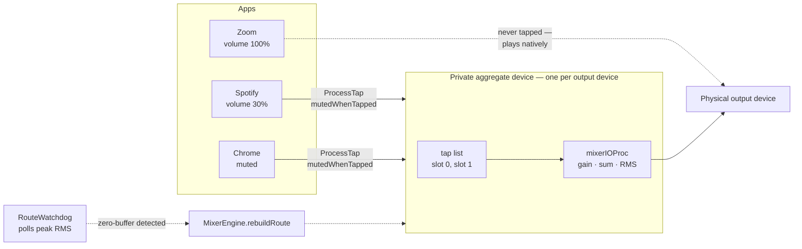

# SoundFlow — Architecture

Reference for the engine. [../CLAUDE.md](../CLAUDE.md) has the build commands
and the short invariant list; this file explains *why* the pipeline is shaped
the way it is, and records the CoreAudio behaviour that is expensive to
rediscover.

---

## 1. The core idea

A CoreAudio process tap is a **wiretap**, not a volume control. By default it
hands you a copy of an application's output while the original keeps playing at
full volume. Turning that into a volume control takes four moving parts:

1. **Silence the app at the source.** The tap is created with
   `muteBehavior = 2` (`.mutedWhenTapped`), so macOS mutes the app's own path
   to the hardware — but only while something is actively reading the tap.
2. **Re-play the copy.** A private aggregate device joins the tap to the real
   output device.
3. **Apply gain in between.** One `AudioDeviceIOProc` on the aggregate reads
   every tap's channels, scales them, and sums them into the output buffers.
4. **Do all of it only when needed.** An app left at 100% is never tapped at
   all, so it keeps its native, zero-added-latency path.



**One route per output device, not per app.** Every attenuated app contributes
one tap to the same aggregate, and one IOProc mixes them. An earlier design
built one aggregate + IOProc per app; N aggregates then fought over the same
physical device.

---

## 2. Ownership

`MixerEngine` is the sole owner of taps and routes. Nothing else creates or
destroys them.

```
MixerEngine  (@MainActor, @Observable)
├── AudioProcessRegistry     who is playing audio  → onChange → refreshApps()
├── AudioDeviceManager       device list + master volume → onDeviceListChanged
├── apps: [AppMix]           display model, freely re-sorted
├── route: AggregateRoute?   the aggregate device
│   └── ioProc: MixerIOProc  the real-time callback + its POD state
├── taps: [ProcessTap]       parallel to the route's tap list
├── routedApps: [AppMix]     slot i of the IOProc belongs to routedApps[i]
└── watchdog: RouteWatchdog  → onNeedsRebuild → rebuildRoute()
```

`RouteWatchdog` deliberately does **not** rebuild anything itself. An earlier
per-app watchdog recreated taps internally and never told the owner the tap id
had changed; the stale id was destroyed later while the real tap leaked and left
the app permanently muted. Recovery is now delegated back to the one component
that owns taps.

Because a rebuild destroys the route, it also destroys that route's watchdog —
so the **recovery budget cannot live in the watchdog's lifetime.** `MixerEngine`
holds `routeRecoveryAttempts`, reads it off the dying watchdog in
`rebuildRoute()`, and hands it to the replacement via
`start(carryingOverAttempts:)`. Without that hand-off `maxRecoveryAttempts`
never bites: a permanently dead pipeline is torn down and rebuilt every three
seconds for as long as the app runs. Only a genuine change of circumstances —
a slider move, a device change, a wake, a permission grant — resets the budget,
which is what `syncRoute(preservingRecoveryBudget:)` distinguishes.

When the budget does run out, `onGaveUp` → `MixerEngine.abandonRoute()` drops
the route and sets `routeError`. Dropping it is the correct end state: with no
tap the apps play natively at full volume, which is audibly wrong rather than
silently wrong.

### `syncRoute()` — the single decision point

Every path that could change the audio graph funnels here.

```
syncRoute()
  ├── permission denied?           → return, UI shows PermissionView
  ├── wanted = apps.filter(needsTap)
  ├── wanted empty?                → teardownRoute(), clear error
  ├── no output device UID?        → routeError
  ├── same membership (as a SET)   → applyAllGains(), return
  ├── teardownRoute()
  ├── create a ProcessTap per app  → DRM / permission errors classified here
  ├── AggregateRoute.start(taps:)  → fails → destroy taps, set routeError
  └── applyAllGains(), start watchdog
```

The membership check compares `wanted` and `routedApps` as unordered sets. It
must stay that way: `wanted` follows display order, and the list re-sorts
whenever an app starts playing or gets starred. A pairwise comparison treated
those re-sorts as a membership change and tore down a perfectly healthy route —
an audible glitch for every app in it.

`applyOrSync(_:)` is the fast path for a slider drag: if the app is already
routed and still needs a tap, it writes gain straight into the slot and skips
`syncRoute()` entirely.

### What reaches `syncRoute()`

| Trigger | Path |
| :--- | :--- |
| An app starts or stops producing audio | per-process `IsRunningOutput` listener → `AudioProcessRegistry.onChange` → `refreshApps()` |
| An audio process appears or disappears | `kAudioHardwarePropertyProcessObjectList` listener → same path |
| A slider or mute changes | `setVolume` / `setMuted` → `applyOrSync` |
| A device is plugged in or removed | `onDeviceListChanged` → `refreshDevices()` |
| The **default output** changes | `onDefaultOutputChanged` → `refreshOutputState()` |
| The **default input** changes | `onDefaultInputChanged` → `refreshInputState()` (never touches the route) |
| The Mac's **own output level or mute** changes | device-scoped `VolumeScalar` / `Mute` listener → `onOutputLevelChanged` → `readOutputLevel()` (never touches the route) |
| The Mac's **own input gain or mute** changes | same, input scope → `onInputLevelChanged` → `readInputLevel()` |
| The machine wakes | `NSWorkspace.didWakeNotification` → `handleWake()` |
| Permission is granted while running | `refreshPermission()` on app activation |
| The watchdog sees a dead pipeline | `onNeedsRebuild` → `rebuildRoute()` |

> **Two listeners, not one.** The process-list listener only fires when a
> process appears or disappears; it says nothing about an existing process
> starting to play. Playback state comes from a *separate* per-process
> `IsRunningOutput` listener, and those are installed in two places:
> `startMonitoring()` seeds them for processes that already exist, and every
> `snapshot()` re-syncs them as processes come and go.
>
> Both matter. `startMonitoring()` used to install neither, and `MixerEngine`
> called `refreshApps()` — the only thing that reached the re-sync — *before*
> monitoring started, where an `isListening` guard made it a no-op. The result
> was zero output listeners for the whole session: any app already running at
> launch could start playing and nothing fired, so `isPlaying` stayed false
> until something unrelated changed the process list. Observe before you read.
>
> To check this is working: `refreshApps()` logs at debug level, so
> `log stream --predicate 'subsystem == "com.soundflow.app"' --level debug`
> should print a line the moment you press play in any app.

> **The HAL notifies on the main run loop unless told otherwise.** From
> `AudioHardwareDeprecated.h`, on `kAudioHardwarePropertyRunLoop`: *"In 10.6 and
> later, the HAL will use the process's run loop (as defined by
> `CFRunLoopGetMain()`) for this task. […] If the value for this property is set
> to NULL, the HAL will return to its pre-10.6 behavior of creating and managing
> its own thread for notifications."*
>
> Every listener above was therefore a main run-loop source in the **default
> mode**, which means it stopped being delivered whenever anything held the run
> loop in another mode — a tracking menu, or an open `MenuBarExtra` popover.
> That is the app's primary surface: playback could start with the mixer on
> screen and nothing fired until the popover closed.
>
> `caDetachNotificationRunLoop()` sets the property to NULL once per process,
> and both `AudioProcessRegistry.startMonitoring()` and
> `AudioDeviceManager.startMonitoringDeviceChanges()` call it before installing
> anything. Both listener procs were already written for a HAL thread — they
> read one field and hop to main. This makes that true rather than aspirational.

**One refresh per burst.** Every process object carries its own
`IsRunningOutput` listener and they share one C proc, so a single play event
routinely fires several. `notifyChanged()` collapses a burst into one main-queue
hop with a pending flag cleared *before* the callback runs — so it costs one
`refreshApps()`, and anything that changes during a refresh still schedules the
next one. Without it each notification paid for a full `snapshot()` (three IPC
property reads per process on the system) and a route reconciliation.

**What the HAL is not fast at.** Measured on macOS 15 with a signed build:
`IsRunningOutput` going 0 → 1 reaches the listener in **~150–400 ms**, but going
1 → 0 took **~8 s**. The lag is entirely coreaudiod's and the app's — an app
that pauses does not necessarily stop its IOProc, and the HAL tears the state
down lazily. Polling does not beat it (the poll and the listener saw the same
transition 16 ms apart). Do not add machinery trying to: a playing indicator
that lingers briefly after a pause is the honest reading of the only signal the
system offers.

The default-device listeners are separate from the device-list listener on
purpose. Picking a different *existing* device in Control Center or the Sound
pane adds and removes nothing, so `kAudioHardwarePropertyDevices` never fires
for it — with only that listener the route went on feeding the old device and
the picker showed a stale selection.

> **The level listeners are separate again, and for the third time it is the
> same lesson.** All three selectors above live on the **system object**, and
> none of them says anything about a *level*. Pressing the volume keys changes
> no device list, no default device — so nothing fired, and `masterVolume` was
> only ever re-read inside `refreshOutputState()`. The app sat at whatever it
> last happened to read while the Mac was somewhere else entirely: 19% on screen
> against 81% of actual output.
>
> `AudioDeviceManager.observeLevels(outputDeviceID:inputDeviceID:)` installs
> **device-scoped** listeners on the current default pair, and must be called
> again whenever either default changes — these are bound to an `AudioObjectID`,
> and ids are recycled, so one left on the old device is worse than none.
>
> The address set comes from `volumeAddresses(scope:)`, the same helper the read
> path uses, filtered by `AudioObjectHasProperty`. It has to match the read set:
> this Mac's speakers answer only the main element, plenty of interfaces expose
> only the per-channel ones, and a listener on an address the device does not
> implement is silently never delivered. `kAudioDevicePropertyMute` is added on
> the same scope — F10 changes the mute without touching the scalar, so a slider
> reading 81% for a silent Mac is the same bug wearing a different hat.
>
> Notifications are told apart by **scope**, not selector: the same
> `VolumeScalar` arrives for output and input, and one USB interface can be both
> defaults at once.
>
> One change arrives several times — a device answering both the virtual-main
> selector and the scalar fired four notifications per volume step in testing.
> `readOutputLevel()` therefore compares before publishing: assigning an
> unchanged value to an `@Observable` property still invalidates every view
> reading it, and a held volume key would otherwise re-render the mixer four
> times per step.

`refreshOutputState()` keys the "did it actually change?" test on the device
**UID**, not the `AudioDeviceID`: ids are recycled as hardware comes and goes,
so an unplug/replug can hand back the same number for a different device.

**Sleep and wake.** The route is torn down on `willSleepNotification` — done
synchronously via `MainActor.assumeIsolated`, because the system does not wait
for a queue to drain before suspending and a teardown that lands after sleep is
a teardown that did not happen. On wake, `handleWake()` re-reads devices and
rebuilds. The watchdog would eventually catch the post-wake zero-buffer state,
but only after three seconds of silence and only if something is playing.

---

## 3. Threading

| Thread | Runs | Rules |
| :--- | :--- | :--- |
| Main actor | `MixerEngine`, `AppMix`, all SwiftUI | Everything observable lives here. |
| CoreAudio IO thread | `mixerIOProc` | **Real-time.** No allocation, no locks, no Swift runtime, no logging. POD memory only. |
| HAL listener threads | `registryListener`, device listeners | Hop to main immediately and return. Genuinely HAL-owned only because `caDetachNotificationRunLoop()` runs first — see §2. |
| Watchdog thread | `RouteWatchdog.poll()` | `.utility` QoS. Never reads main-actor state. Counters live behind an `OSAllocatedUnfairLock` — `stop()`, `noteRebuilt()` and `recoveryAttempts` are all called from the owner's thread. |
| Watchdog feed timer | `updateWatchdogExpectation()` every 0.5 s | Main actor. Caches "expecting audio" for the watchdog. **Runs only while a route exists** — started by `syncRoute()`, stopped by `teardownRoute()`. |
| Playback poll | `pollPlaybackState()` every 0.5 s | Main actor. Backstop under the `IsRunningOutput` listeners. **Runs only while a mixer surface is on screen** — refcounted by `MixerView`'s `onAppear`/`onDisappear`, and it stops itself if no window is visible. |

Two crossings deserve attention:

**Main → audio thread.** `gain` and `muted` are written by the main thread and
read by the callback; `rms` goes the other way. They are naturally aligned
32-bit scalars, so loads and stores are indivisible on every architecture macOS
supports — no tearing is possible. No ordering guarantees are needed because
each value is independent and one buffer of latency is fine.

**Watchdog → main actor.** The watchdog needs to know whether anything *should*
be playing (silence is only suspicious if it is unexpected), but reading
`@MainActor` state from its thread would be unsafe. So `updateWatchdogExpectation()` caches
the answer into an `OSAllocatedUnfairLock`-guarded `Bool` on each tick, and the
watchdog reads that.

---

## 4. Channel mapping

The aggregate device's **input** side carries the sub-device's own input
channels first (a USB interface with mic inputs, say), then one region per tap
in tap-list order. `AggregateRoute.placements(for:)` works out where the tap
regions start:

```
base = max(0, totalInputChannels - Σ tapChannels)
```

For speakers, AirPods, or HDMI — devices with no inputs — `base` is simply 0.

`MixerIOProc.configure(placements:)` then resolves each global channel index to
a concrete `(buffer, offset, stride)` triple by inspecting the real stream
configuration. This handles both interleaved buffers (`mNumberChannels > 1`) and
one-buffer-per-channel layouts; an earlier IOProc assumed the latter and
produced wrong channel math on real hardware. A tap with more channels than the
device folds onto what exists via `channel % outputChannelCount`.

The callback itself only walks the resulting flat arrays — all the reasoning
happens at configure time, off the audio thread.

**Gain curve:** `MixerIOProc.setVolume(slot:sliderValue:)` stores
`gain = slider²`. Perceived loudness tracks roughly the square of amplitude, so
the squared curve makes a linear slider feel linear to the ear. Range is
`0...1`; `PLAN.md`'s 0–150% was never implemented.

**RMS** is measured on each slot's *first* channel only — enough for diagnostics and
for the watchdog's silence detection, and it keeps the inner loop cheap.

**`diagnostics.inputPeak` is opt-in.** Computing it means scanning every sample
of input buffer 0 on every callback, ~87 times a second, for a number nothing in
the app reads. `MixerIOProc.measuresInputPeak` defaults to `false`; the spike
CLI, `SelfTest` and `TapPermission.verifyAudioFlows` set it because separating
"the tap is silent" from "our gain zeroed it" is exactly their job.

---

## 5. Permission

This is the single most misleading part of the API.

With TCC denied, `AudioHardwareCreateProcessTap` still returns `noErr`. The tap
object is valid, the aggregate builds, the IOProc fires ~87 times a second with
4096-byte buffers — and every sample is zero. There is no error anywhere. Any
probe of the form "did tap creation succeed?" therefore always answers
"granted" and is worthless.

On macOS 15+ system-audio capture is gated by the **same TCC service as screen
recording** (the pane is literally "Screen & System Audio Recording"), so:

- `TapPermission.status()` → `CGPreflightScreenCaptureAccess()`
- `TapPermission.request()` → `CGRequestScreenCaptureAccess()`, which raises the
  real prompt (once — macOS never asks twice, hence the Settings deep link
  fallback in `PermissionView`)
- `TapPermission.verifyAudioFlows(...)` is the heavyweight ground-truth check:
  tap a process that is actually playing and look for a non-zero sample. Costs
  ~2 s, so it is a diagnostic, not a routine check. Currently has no callers.

Because TCC binds a grant to a **code identity**, an unsigned SwiftPM binary can
never hold the permission — which is why every run path goes through a signed
`.app` bundle, and why `scripts/setup-signing.sh` exists.

### Error classification

`ProcessTapEngine.classify(_:)` maps `OSStatus` to intent:

| Status | Meaning |
| :--- | :--- |
| `560947818` (`kAudioHardwareIllegalOperationError`, `'what'`), `-50` | TCC blocked the tap → `.permissionDenied` |
| `kAudioHardwareBadObjectError`, `kAudioHardwareNotRunningError` | → `.drmProtected` |
| `noErr` **with** `tapID == kAudioObjectUnknown` | Silent success = how a FairPlay stream fails → `.drmProtected` |
| anything else | `.failed(status)` |

A `.drmProtected` app gets `isDRMProtected = true`, is excluded from `needsTap`
forever after, and the UI greys its row out.

---

## 6. Leak safety

A leaked tap is worse than a crash: it keeps a real application silent after
SoundFlow is gone. Three defences, in order:

1. **`muteBehavior = 2`.** The app is muted only while the aggregate is reading.
   If SoundFlow dies, the tap dies with it and audio returns on its own. An
   earlier build used unconditional `.muted` (`1`) and could strand an app.
2. **`applicationWillTerminate`** calls `engine.stop()` → `teardownRoute()`.
3. **Launch-time sweep.** `MixerEngine.start()` runs
   `TapMaintenance.destroyOrphanedTaps()` and
   `AggregateRoute.destroyOrphanedRoutes()` before anything else. Ownership is
   recognised by naming: taps are `"SoundFlow Tap <processObjectID>"`, aggregate
   UIDs are `com.soundflow.route.<outputDeviceUID>`. The aggregate UID is
   deterministic per output device so stale ones get replaced rather than
   accumulating.

Reading a tap's name needs care: `kAudioTapPropertyDescription` returns a
`CATapDescription` **object**, not a string, so `caString` cannot read it — see
`TapMaintenance.tapName(_:)`.

---

## 7. The app layer

### `AppMix`

One row in the mixer, keyed by **bundle id**. A single app routinely owns several
audio process objects — Chromium and Electron apps (Chrome, Arc, Spotify,
Discord, Slack) play from a helper process that reports the *parent's* bundle id
— so `groupByBundle(_:)` collapses them into one row.

**How they are collapsed is load-bearing.** `refreshApps()` used to keep the
first process it saw and discard the rest, and that was a real bug:
`kAudioHardwarePropertyProcessObjectList` has no defined order, so when a silent
main process sorted ahead of a playing helper its `IsRunningOutput` of `0`
became the row's answer. The indicator stayed dark for seconds — until the list
happened to reorder or the idle object was torn down — while every notification
in between arrived on time and was thrown away.

So `isPlaying` is the **union** across the group, and the representative process
— the one the tap is built on — is whichever member is actually producing
output, falling back to the first. That second half also satisfies invariant 2
better than first-wins did: the tap lands on the process emitting the audio
rather than an idle sibling. `AppMix.processObjectIDs` keeps the whole group, so
the playback poll can re-read it without re-enumerating the HAL.

`describe(process:bundleID:)` resolves a name and icon from
`NSRunningApplication`, falling back to a disk lookup via `NSWorkspace`;
anything that resolves to neither is skipped, which is what keeps daemons and
XPC helpers out of the list. The `NSRunningApplication` half is always asked
fresh — it is an in-memory query, and it is the answer that must not be stale.
The `NSWorkspace` half is memoised by bundle id, negatives included, because it
reaches LaunchServices and then the disk and used to run for every unresolved
process on every refresh. Negatives are dropped on
`NSWorkspace.didLaunchApplicationNotification`: an app that was not installed
when we asked is the only way one becomes wrong.

| Field | Notes |
| :--- | :--- |
| `volume`, `isMuted` | Persisted. Drive `needsTap`. |
| `needsTap` | `isActive && !isDRMProtected && (isMuted \|\| volume < 0.999)` |
| `isActive` | `false` for a starred app with no live CoreAudio process. No process object, so it can never be tapped. |
| `isPlaying` | The union of `IsRunningOutput` across **every** process object with this bundle id. Drives the sidebar's **Playing** filter, the row's playing indicator, and the sort. It is only as live as the per-process listeners that feed it — see below. |
| `isSilenced` | `isMuted \|\| volume < 0.01`. Playing, but nothing of it reaches the speakers. Display-only: it flattens the indicator and has no bearing on the route, which `needsTap` decides. |
| `isDRMProtected` | Set by tap failure. Disables the controls. |
| `isFavorite` | Persisted. **Display filter only.** |
| `customName` / `displayName` | Persisted override. UI must read `displayName`. |

`id` is declared `nonisolated` in an extension so SwiftUI's `List` can read it
without hopping to the main actor.

### Display rules

- The **main window** lists every app; the **menu bar** lists only starred ones.
  With nothing starred the menu falls back to showing everything, so it is never
  an empty dead end.
- Sort order is **starred → playing → name**, applied by
  `MixerEngine.sortApps(_:)`. Both the star toggle and a rename re-sort.
- Both surfaces are the same `MixerView`, switched by `compact`. The pencil and
  star are hidden in compact mode (`showsRowActions`): that list is already
  filtered, and editing belongs in the window.
- Renaming is inline: double-click the name, or use the row's context menu, or
  the pencil's sheet. Blank input, or input equal to the system name, clears the
  override rather than storing a duplicate. The system name stays in the tooltip
  so a renamed row can still be traced back to its process.
- Icons are per-app. The default is whatever macOS reports; `CustomizeAppSheet`
  can swap in a tile generated from the bundle id. Hues are quantized to the
  twelve in `GeneratedIcon.hues` rather than `hash % 360`, because a raw hue
  lets two apps land a few degrees apart and a near-miss reads as a rendering
  bug. Display-only — nothing here touches the route.
- **Starred apps persist through quitting.** `refreshApps()` appends an
  inactive row for every favourite missing from the HAL snapshot, so a
  favourite never disappears from the menu just because it stopped playing.
  Name and icon come from the installed bundle via `describeBundle(_:)`; a
  renamed app still gets a row even if the bundle cannot be found, since the
  user chose that label deliberately. Inactive rows read "Not running", are
  dimmed to 65%, and keep working controls — the level is saved and applies the
  next time the app produces audio. Unstarring an inactive row removes it
  outright, since nothing is left to show.
- The main window is a **nav bar plus three tabs** — Mixer, Devices, Settings.
  The **master level stays on the Mixer tab** as a row above the app list: it is
  adjusted constantly, and burying it a tab away would be a downgrade. Only
  device *selection* moved to Devices.
- **Devices** holds the Output and Input pickers with a level for each. Input is
  the *system default capture device*: selecting one writes
  `kAudioHardwarePropertyDefaultInputDevice`, exactly what the Sound settings
  pane does, and has nothing to do with the per-app output route —
  `selectInputDevice` calls `refreshInputState()` only, never `refreshDevices()`.
  Either slider hides when the device exposes no settable volume
  (`hasMasterVolumeControl` / `hasInputVolumeControl`); common for HDMI outputs
  and most microphones.
- **There is no `Settings` scene.** Settings is a tab. With the Dock icon hidden
  there is no app menu, so `Cmd+,` and `SettingsLink` would be a dead end.
- The menu bar popover keeps **Output picker + master level + starred apps +
  footer**, and no tabs — a dropdown is for a two-second adjustment. The footer
  has **Open SoundFlow** and **Quit**, and renders even when permission is
  denied: with the Dock icon hidden it is the only route back into the app, and
  Quit is the only thing that runs `applicationWillTerminate` and destroys the
  taps. `openWindow(id: "main")` is followed by `NSApp.activate()`, required in
  `.accessory` mode.

### Theming

`Theme` is one accent colour and nothing else. `MixerView` resolves the stored
id from `@AppStorage(Preferences.themeKey)` and applies it **once** at the root
as `.tint()`, so `Slider`, the star button, `Toggle` and selection states all
follow with no per-view plumbing. `\.themeAccent` carries the raw `Color` for
the few places that draw their own shapes — the sidebar's selection tint, the
window's accent wash, and `PlayingIndicator`.

Preset colours are deliberately mid-tone: a colour that reads well on white
usually washes out on charcoal, so nothing sits at the extremes of lightness.
`Themes.theme(id:)` falls back to the system accent, so an id from a future
build degrades quietly rather than losing colour entirely.

`PlayingIndicator` is four bars pulsing on a loop beside any app with
`isPlaying` set. It is **not** a level meter, and the distinction was learned
the hard way.

It used to be one: three bars driven by `AppMix.level`, which the engine wrote
from slot RMS every 80 ms. The flaw is structural. Only a *tapped* app produces
RMS, and invariant 8 means an app left at 100% is never tapped — so its level
was permanently zero, every bar sat at its 2pt floor, and the row showed three
dots that read as a truncated name. A meter that is flat for exactly the apps
the user has not touched is worse than no meter: it looks broken, and it is
silent about the one thing it exists to say.

The replacement animates identically for every playing app, tapped or not, and
reads nothing from the audio path.

**The flat state is not a return to that.** An app with `isSilenced` set draws a
single dimmed line instead of the bars: it is still producing audio, and the
user is hearing none of it. That comes from `volume` and `isMuted` — the user's
own setting — so it is exact, and it is the one thing the pulse cannot say.
`isPlaying` is upstream of our gain stage, so without it a muted app animated
exactly like an audible one.

Two details are deliberate. The flat state is **one capsule, not four squashed
bars**: at flat height the separate bars read as dots beside the name, which is
the exact failure above. And it is a *branch between two subviews* rather than a
frozen version of one — the pulse is a `repeatForever` keyed on a one-shot
`@State` flip in `onAppear`, so flattening by setting that flag back would run
the stop through the same repeating curve. Destroying the animated view ends it
outright, and rebuilding it restarts the loop cleanly. The container is pinned
to the bars' natural 16 × 14pt footprint so nothing shifts either way.

### Persistence

All in `UserDefaults`, all keyed by bundle id, so settings survive both quitting
the app and restarting SoundFlow.

Writes to the volume blob are **debounced by 400 ms**. A slider drag calls
`persist` on every frame and each call re-encodes the whole dictionary to JSON on
the main thread; only the last value matters. `MixerEngine.stop()` flushes any
pending write, so a level set moments before quitting is not lost.

| Key | Shape | Cleared by |
| :--- | :--- | :--- |
| `SoundFlow.appPreferences` | JSON blob `[bundleID: {volume, isMuted}]` | "Reset All Volumes" |
| `SoundFlow.favoriteApps` | `[String]` | nothing |
| `SoundFlow.customNames` | `[String: String]` | nothing (per-app, via the pencil or context menu) |
| `SoundFlow.appIconStyles` | JSON blob `[bundleID: {source, hue, isSolid, letters}]` | nothing (per-app, via the pencil). Only customised apps are stored; setting a style back to the default removes the entry. |
| `SoundFlow.hideDockIcon` | `Bool` | nothing |

Launch-at-login is deliberately **not** in this table. `SMAppService.mainApp` is
its own source of truth; a mirrored `UserDefaults` flag would drift the moment
the user toggles the item in System Settings → General → Login Items. The
toggle in `Sidebar` re-reads the real status on appear, and reverts itself
if registration throws — which it will for an unsigned or quarantined bundle.
`status == .requiresApproval` means the user disabled it in System Settings and
is reported honestly as off.

> **Do not add fields to `AppPreference`.** Swift's synthesised `Codable`
> ignores property defaults for missing keys, so a new field makes every
> existing blob fail to decode — and `Preferences.load()` swallows that with
> `try?`, silently resetting everyone's volumes. Favourites and custom names use
> separate keys for this reason (and so "Reset All Volumes" does not wipe them).

---

## 8. Failure modes

| Symptom | Likely cause | Where to look |
| :--- | :--- | :--- |
| Everything silent, IOProc firing, all samples zero | TCC denied, or running an unsigned binary | `TapPermission.status()`; run from a signed bundle |
| IOProc never fires | Aggregate never started IO | `MixerIOProc.diagnostics.callbacks == 0`; check `waitForStreams()` |
| Input arrives but output is silent | Channel mapping | `diagnostics.inputPeak > 0` but RMS 0 → `configure(placements:)` |
| One app silences the others | IOProc assigning instead of accumulating | `outSamples[i] += scaled` |
| App stuck muted after a crash | Leaked tap | Launch sweep; confirm `muteBehavior == 2` |
| Audio dies after sleep/wake | Zero-buffer failure | Watchdog should rebuild within ~3 s |
| Clicks/dropouts when the list changes | Route rebuilt unnecessarily | `syncRoute()` set-based membership check |

`MixerIOProc.diagnostics` exists precisely to separate these: `callbacks`
distinguishes "IO never started" from "IO running but silent", and
`lastInputPeak` distinguishes "the tap is silent" from "our gain or mapping
zeroed it".

The watchdog's numbers: polls every **0.5 s**, needs **6** consecutive silent
polls (**3 s**) while audio is expected, allows **5** rebuild attempts. Anything
above `1e-7` peak RMS resets the counters.

### Tools

```bash
./scripts/run-spike.sh --selftest
```

Runs the engine headless from a signed bundle and reports pass/fail per stage.
`SelfTest` also has a global-tap control case: if a global tap carries audio
while a per-process tap does not, the fault is in process targeting, not in the
tap/aggregate/IOProc plumbing.

---

## 9. Power and Apple silicon

```bash
./scripts/power-test.sh
```

`audit` checks the binary statically; `sample <label> <seconds>` measures the
running app; `compare` walks a window-closed vs window-open A/B; `deep` prints
`powermetrics` commands for you to run yourself.

No sudo required for the parts that matter. `top -stats pid,cpu,power,idlew`
reports the same **Energy Impact** number Activity Monitor shows plus **idle
wakeups**, per process. Energy behaviour only exists in the real running app —
an XCTest process has no menu bar, no SwiftUI redraw loop and no IOProc, which
is exactly where this app's power goes, so the harness is a shell script rather
than a test target.

**Idle wakeups are the metric that matters.** Each one pulls a core out of a
low-power state; a background app that never sleeps is what drains a battery
overnight. CPU percentage barely moves for an app like this, so it is the
weaker signal.

Measured on an M4, idle with no apps attenuated:

| Metric | Baseline 2026-07-30 | After 2026-07-30 | Target |
| :--- | :--- | :--- | :--- |
| CPU | 0.11% avg | 0.13% avg | ≤ 1% |
| Energy impact | 0.42 | 0.39 | ≤ 1.0 |
| Idle wakeups | 6.6/s | 5.7/s | ≤ 5/s |
| Threads | 8 | 10 | — |

The baseline wakeup number traced to one line: the timer fired every **0.08 s**
and was started unconditionally in `start()`, so it kept running when no route
existed, nothing was being metered, and no UI was on screen.

`startWatchdogFeed()` / `stopWatchdogFeed()` now bracket the route's lifetime,
so an idle SoundFlow runs no timer at all.

The timer was also **retimed from 0.08 s to 0.5 s** when the level meters were
removed. 12.5 Hz existed to make bars move smoothly; all that survives is one
boolean the watchdog samples against a three-second window, which does not need
it. That change also deleted the per-app `app.level` write — which, even guarded
to fire only on a move of more than 0.002, invalidated every routed row up to
12.5×/s for a value nothing now reads.

macOS coalesces aggressively, so removing the original 12.5 Hz timer only bought
about 1 wakeup/s. The remaining 5.7/s is SwiftUI, the `MenuBarExtra` and the HAL
listeners. One lever named in the original analysis is still unused: suspend the
feed when neither the window nor the popover is visible.

**The playback poll pays that lever forward.** It is a second 0.5 s timer, but it
is bracketed by visibility rather than by the route: `MixerView`'s
`onAppear`/`onDisappear` refcount it, and `pollPlaybackState()` also stops itself
if `NSApp` has no visible window, so a `MenuBarExtra` popover that never delivers
`onDisappear` cannot leave it running. A SoundFlow sitting in the menu bar with
nothing open runs no timer at all, which is the state it spends its day in.

Per tick it reads one `UInt32` per process object already in `apps` — no
`snapshot()`, which re-enumerates the HAL and reads a pid and a bundle id for
every process on the system, and no `describe()`. When nothing changed it
publishes nothing, so the common case costs the reads and no SwiftUI work.

`ProcessTapEngine` and `MixerIOProc` are arm-friendly: the callback touches only
POD memory, allocates nothing, and takes no locks. The one piece of avoidable
work in the hot path — the `lastInputPeak` scan over every sample of input
buffer 0 — is now behind `MixerIOProc.measuresInputPeak`, which the app leaves
off and only the diagnostic tools set.

## 10. Implemented but unused

Live and tested, with no current callers — know they exist before writing
something similar.

| API | Notes |
| :--- | :--- |
| `AggregateRoute.setTaps(_:)` | Updates a live route's tap list in place (`kAudioAggregateDevicePropertyTapList` is settable), falling back to a rebuild. `MixerEngine` always rebuilds instead. The obvious optimisation if rebuild glitches ever matter. |
| `TapPermission.verifyAudioFlows(...)` | Ground-truth permission check, ~2 s. |
| `ProcessTap.createGlobal(excluding:)` | Diagnostic control case; `SelfTest` only. |
| `AudioDeviceManager.isMuted(deviceID:scope:)`, `setMuted(_:deviceID:scope:)` | Device-level mute, in either scope. No UI uses it — per-app mute goes through the IOProc slot instead, and there is no hardware mic-mute button yet. |

`RouteWatchdog.onGaveUp` used to sit in this table. It is now wired to
`MixerEngine.abandonRoute()`, which is what makes `maxRecoveryAttempts` an
actual limit rather than a number nothing reads.
